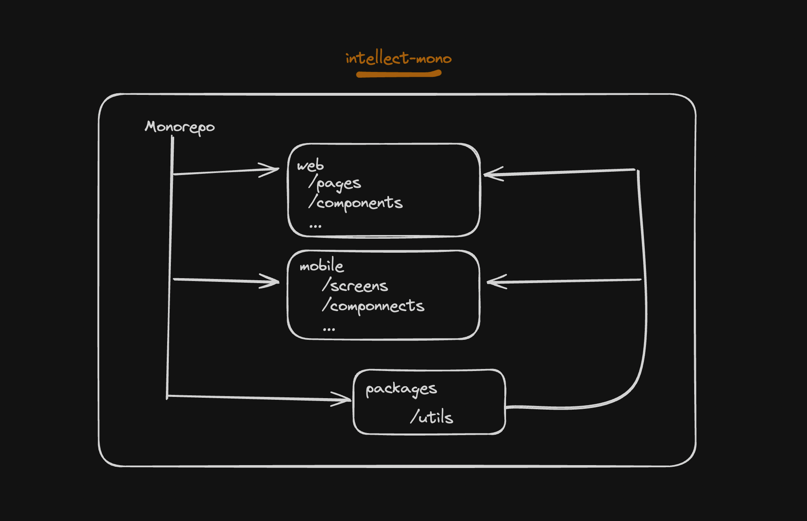

# intellect-mono

This is a simple mono repo structure, housing muiltiple Javascript based applictions.

## Quick Start

```shell
npm i pnpm -g

git clone git@github.com:shivnath17/intellect-mono.git

cd intellect-mono

# install dependencies of our app at first
pnpm install
pnpm utils build

# start web app
pnpm web dev

# start mobile app
pnpm mobile ios #or pnpm mobile android
```

## Tech Stack

| Description          | Technology            |
| :------------------- | :-------------------- |
| Package Manager      | PNPM                  |
| Programming Language | Typescript            |
| Framework            | React.js, ReactNative |
| Bundler              | Vite                  |
| Linter               | ESLint                |
| Formatter            | Prettier              |

## Architecture Diagram



## Demo

#### Web App: https://exquisite-quokka-b695d6.netlify.app/

#### Mobile App


## Author

- [@shivnath17](https://www.github.com/shivnath17)
